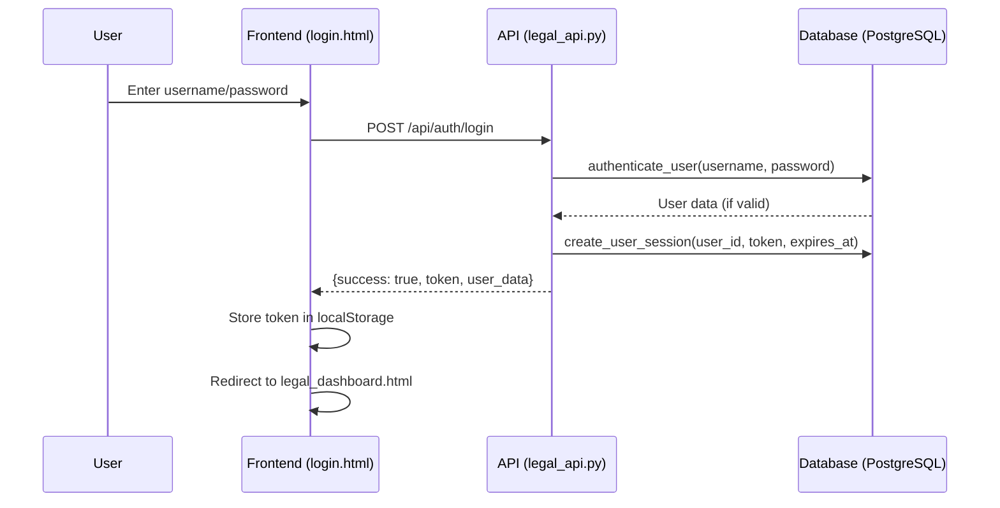
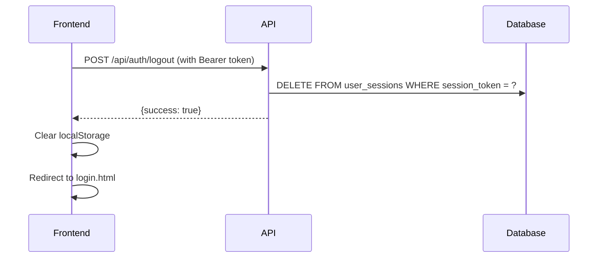
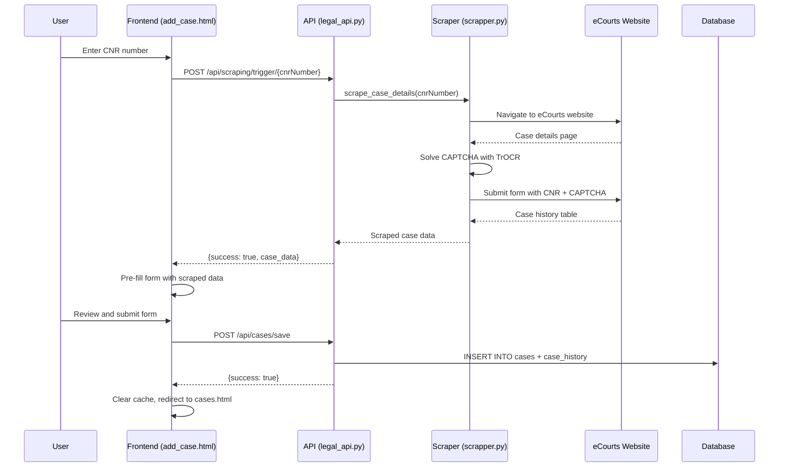
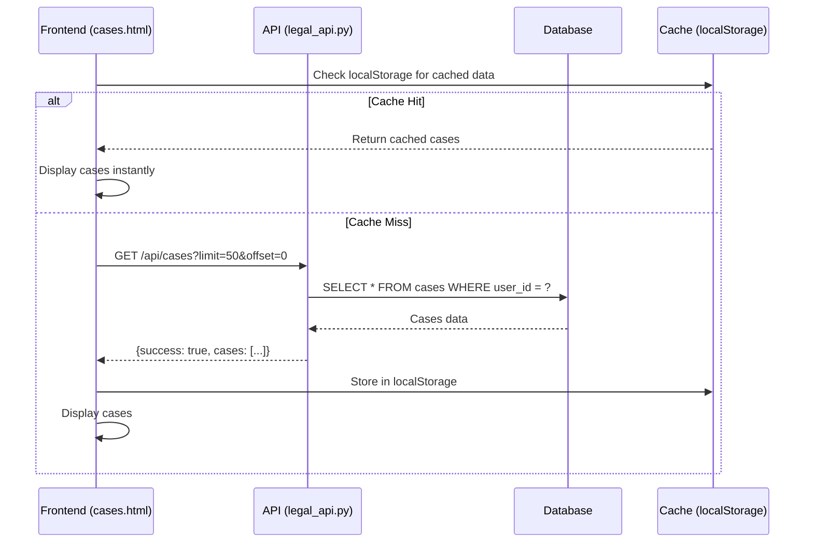
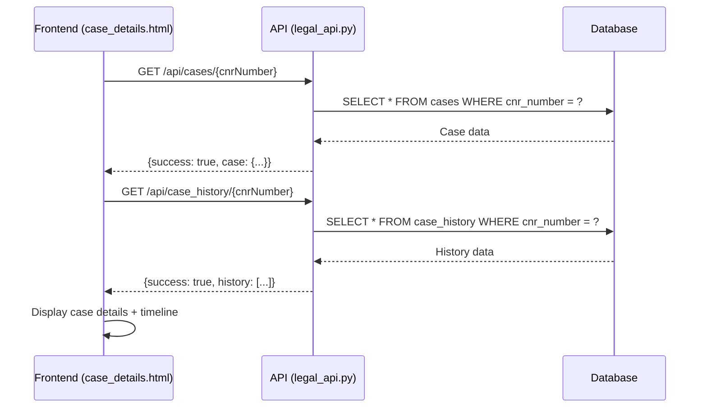
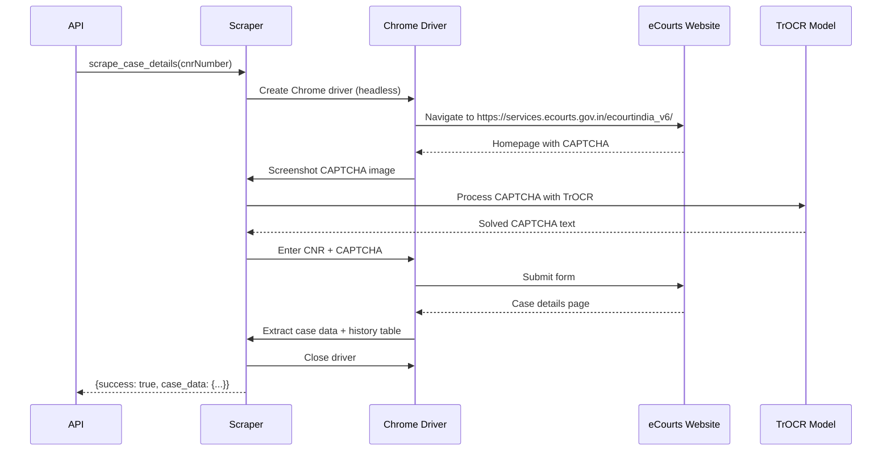
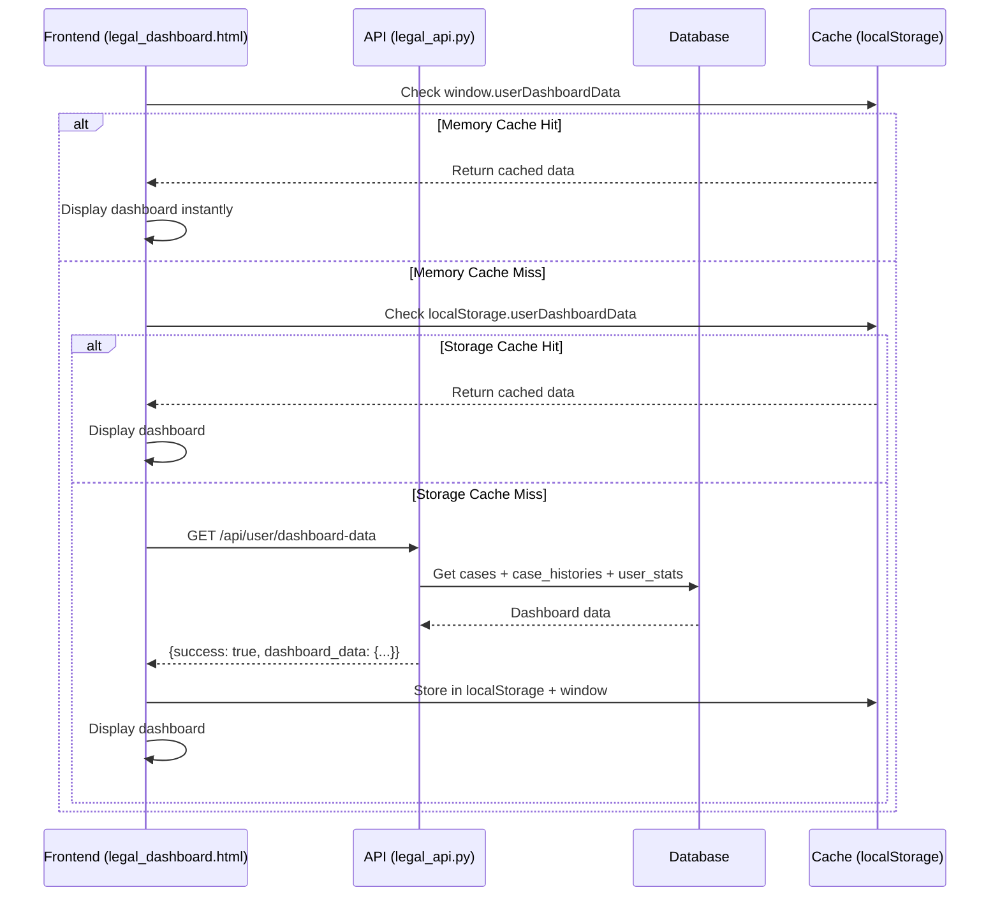
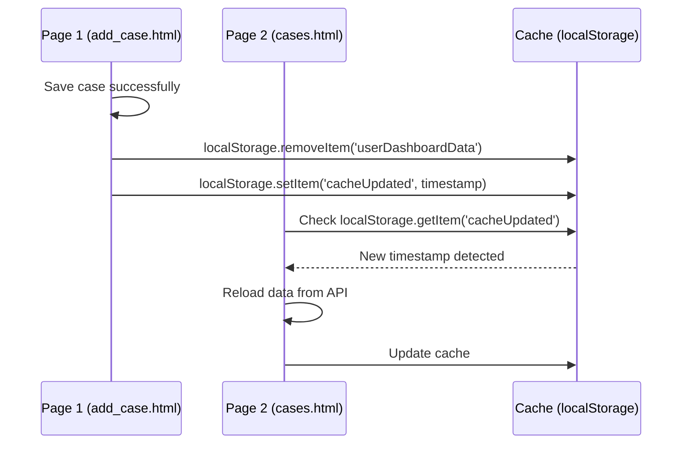
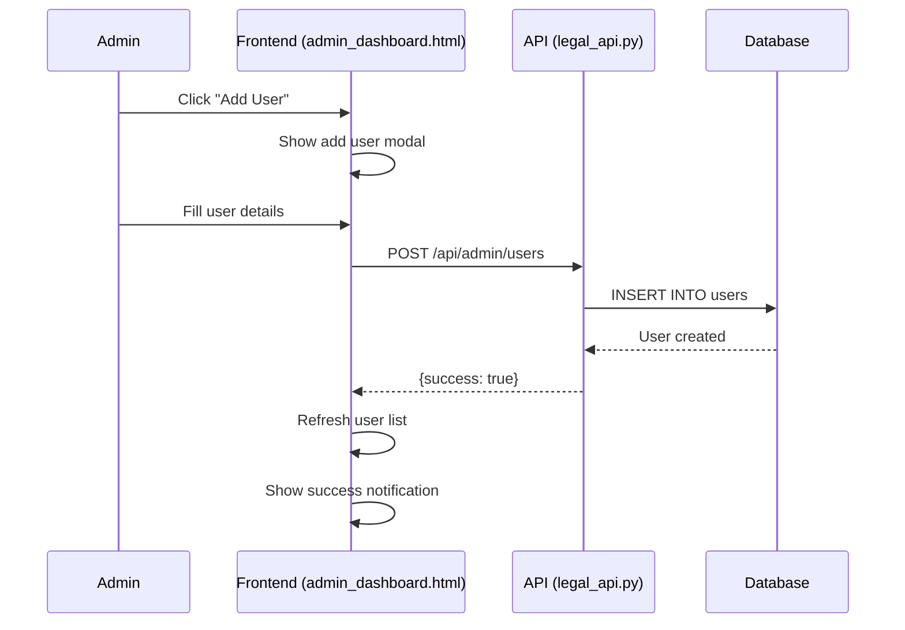
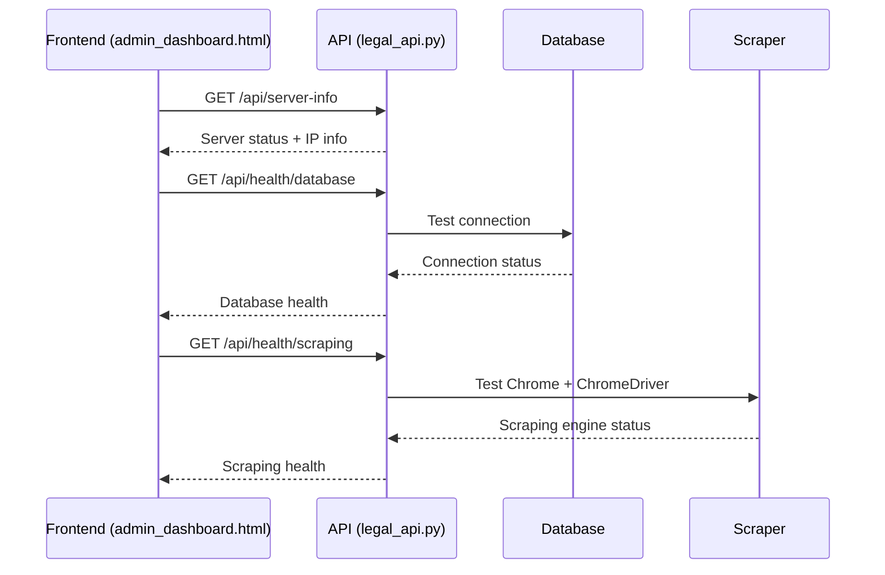

# Legal Case Management System - Flow Documentation

## 📋 Table of Contents
1. [System Architecture Overview](#system-architecture-overview)
2. [Authentication Flow](#authentication-flow)
3. [Case Management Flow](#case-management-flow)
4. [Scraping Flow](#scraping-flow)
5. [Dashboard & Caching Flow](#dashboard--caching-flow)
6. [Admin Dashboard Flow](#admin-dashboard-flow)
7. [API Endpoints Reference](#api-endpoints-reference)
8. [Database Schema](#database-schema)
9. [Frontend-Backend Communication](#frontend-backend-communication)

---

## 🏗️ System Architecture Overview

### **Components**
- **Frontend**: HTML/CSS/JavaScript (Port 8000)
- **Backend API**: Flask/Python (Port 5002)
- **Database**: PostgreSQL (Port 5432)
- **Scraping Engine**: Selenium + Chrome + TrOCR
- **Web Server**: Python HTTP Server

### **Key Files**
```
├── Frontend Pages
│   ├── login.html              # User authentication
│   ├── legal_dashboard.html    # Main dashboard
│   ├── cases.html             # Case management
│   ├── add_case.html          # Add new cases
│   ├── edit_case.html         # Edit existing cases
│   ├── case_details.html      # Case details & timeline
│   ├── clients.html           # Client management
│   ├── calendar.html          # Calendar view
│   └── admin_dashboard.html   # Admin panel
│
├── Backend
│   ├── legal_api.py           # Main Flask API
│   ├── database_setup.py      # Database operations
│   └── scrapper.py            # eCourts scraping
│
├── Configuration
│   ├── config.js              # Dynamic URL configuration
│   └── requirements.txt       # Python dependencies
│
└── Installation Scripts
    ├── install_ec2_amazon_linux.sh
    ├── install_chrome_amazon_linux.sh
    └── fix_chromedriver_new.sh
```

---

## 🔐 Authentication Flow

### **1. Login Process**


### **2. Session Management**
- **Token Generation**: `secrets.token_urlsafe(32)` (32-character URL-safe token)
- **Session Duration**: 24 hours
- **Storage**: `user_sessions` table with `user_id`, `session_token`, `expires_at`
- **Validation**: `@require_auth` decorator checks token on protected endpoints

### **3. Logout Process**


---

## 📁 Case Management Flow

### **1. Add New Case Flow**


### **2. Case Display Flow**


### **3. Case Details Flow**


---

## 🕷️ Scraping Flow

### **1. eCourts Scraping Process**


### **2. Scraping Configuration**
- **Headless Mode**: `HEADLESS = True` for EC2
- **Chrome Options**: `--no-sandbox`, `--disable-dev-shm-usage`, `--disable-gpu`
- **CAPTCHA Solving**: TrOCR model `anuashok/ocr-captcha-v3`
- **Retry Logic**: 3 attempts with exponential backoff
- **Data Extraction**: Case details + hearing history table

---

## 📊 Dashboard & Caching Flow

### **1. Dashboard Data Loading**


### **2. Cache Invalidation**


### **3. Real-time Updates**
- **Cache Clearing**: After add/edit/delete operations
- **Cross-page Sync**: `localStorage.setItem('cacheUpdated', timestamp)`
- **Auto-refresh**: Pages check for cache updates every 1 second
- **Performance**: Instant display from cache, background API refresh

---

## 👨‍💼 Admin Dashboard Flow

### **1. User Management**


### **2. System Monitoring**


---

## 🔌 API Endpoints Reference

### **Authentication Endpoints**
| Method | Endpoint | Description | Auth Required |
|--------|----------|-------------|---------------|
| POST | `/api/auth/login` | User login | No |
| POST | `/api/auth/logout` | User logout | Yes |
| GET | `/api/server-info` | Server information | No |

### **Case Management Endpoints**
| Method | Endpoint | Description | Auth Required |
|--------|----------|-------------|---------------|
| GET | `/api/cases` | Get all cases | Yes |
| GET | `/api/cases/{cnr}` | Get specific case | Yes |
| POST | `/api/cases/save` | Save new case | Yes |
| PUT | `/api/cases/{cnr}` | Update case | Yes |
| DELETE | `/api/cases/{cnr}` | Delete case | Yes |
| GET | `/api/case_history/{cnr}` | Get case history | Yes |

### **Scraping Endpoints**
| Method | Endpoint | Description | Auth Required |
|--------|----------|-------------|---------------|
| POST | `/api/scraping/trigger/{cnr}` | Trigger scraping | Yes |
| GET | `/api/health/scraping` | Check scraping health | Yes |

### **Dashboard Endpoints**
| Method | Endpoint | Description | Auth Required |
|--------|----------|-------------|---------------|
| GET | `/api/user/dashboard-data` | Get dashboard data | Yes |
| GET | `/api/user/profile` | Get user profile | Yes |

### **Admin Endpoints**
| Method | Endpoint | Description | Auth Required |
|--------|----------|-------------|---------------|
| GET | `/api/admin/users` | Get all users | Yes (Admin) |
| POST | `/api/admin/users` | Create user | Yes (Admin) |
| PUT | `/api/admin/users/{id}` | Update user | Yes (Admin) |
| DELETE | `/api/admin/users/{id}` | Delete user | Yes (Admin) |
| GET | `/api/health/database` | Database health | Yes (Admin) |

---

## 🗄️ Database Schema

### **Users Table**
```sql
CREATE TABLE users (
    id SERIAL PRIMARY KEY,
    username VARCHAR(50) UNIQUE NOT NULL,
    email VARCHAR(100) UNIQUE NOT NULL,
    password_hash VARCHAR(255) NOT NULL,
    full_name VARCHAR(100) NOT NULL,
    role VARCHAR(20) DEFAULT 'user',
    phone VARCHAR(15),
    is_active BOOLEAN DEFAULT true,
    created_at TIMESTAMP DEFAULT CURRENT_TIMESTAMP
);
```

### **User Sessions Table**
```sql
CREATE TABLE user_sessions (
    id SERIAL PRIMARY KEY,
    user_id INTEGER REFERENCES users(id),
    session_token VARCHAR(255) UNIQUE NOT NULL,
    expires_at TIMESTAMP NOT NULL,
    created_at TIMESTAMP DEFAULT CURRENT_TIMESTAMP
);
```

### **Cases Table**
```sql
CREATE TABLE cases (
    id SERIAL PRIMARY KEY,
    cnr_number VARCHAR(50) UNIQUE NOT NULL,
    case_title VARCHAR(255),
    petitioner VARCHAR(255),
    respondent VARCHAR(255),
    case_type VARCHAR(100),
    filing_date DATE,
    court_name VARCHAR(255),
    judge_name VARCHAR(255),
    registration_number VARCHAR(100),
    status VARCHAR(50),
    user_id INTEGER REFERENCES users(id),
    created_at TIMESTAMP DEFAULT CURRENT_TIMESTAMP,
    updated_at TIMESTAMP DEFAULT CURRENT_TIMESTAMP
);
```

### **Case History Table**
```sql
CREATE TABLE case_history (
    id SERIAL PRIMARY KEY,
    cnr_number VARCHAR(50) REFERENCES cases(cnr_number),
    hearing_date DATE,
    purpose_of_hearing TEXT,
    status VARCHAR(50),
    user_id INTEGER REFERENCES users(id),
    created_at TIMESTAMP DEFAULT CURRENT_TIMESTAMP
);
```

---

## 🌐 Frontend-Backend Communication

### **1. Dynamic URL Configuration**
```javascript
// config.js - Dynamic IP detection
class Config {
    async init() {
        try {
            const response = await fetch(`http://${window.location.hostname}:5002/api/server-info`);
            const data = await response.json();
            this.API_HOST = data.public_ip || window.location.hostname;
        } catch (error) {
            this.API_HOST = window.location.hostname;
        }
    }
    
    getApiUrl(endpoint = '') {
        return `http://${this.API_HOST}:5002/api${endpoint}`;
    }
}
```

### **2. Authentication Headers**
```javascript
// All API calls include authentication
const response = await fetch(url, {
    headers: {
        'Authorization': `Bearer ${localStorage.getItem('userToken')}`,
        'Content-Type': 'application/json'
    }
});
```

### **3. Error Handling**
```javascript
// 401 Unauthorized handling
if (response.status === 401) {
    localStorage.removeItem('userToken');
    localStorage.removeItem('userRole');
    window.location.href = 'login.html';
    return;
}
```

### **4. CORS Configuration**
```python
# legal_api.py - Dynamic CORS origins
def get_cors_origins():
    try:
        response = requests.get(f"http://{socket.gethostbyname(socket.gethostname())}:5002/api/server-info")
        data = response.json()
        return [
            f"http://{data['public_ip']}:8000",
            f"http://{data['public_ip']}:5002",
            "http://localhost:8000",
            "http://127.0.0.1:8000"
        ]
    except:
        return ["http://localhost:8000", "http://127.0.0.1:8000"]
```

---

## 🚀 Performance Optimizations

### **1. Caching Strategy**
- **Memory Cache**: `window.userDashboardData` for instant access
- **Storage Cache**: `localStorage.userDashboardData` for persistence
- **API Cache**: Pre-built calendar events from backend
- **Cache Invalidation**: Timestamp-based cross-page sync

### **2. Lazy Loading**
- **Pagination**: Cases loaded in batches of 50
- **Progressive Enhancement**: Cache-first, API fallback
- **Background Refresh**: Non-blocking cache updates

### **3. Network Optimization**
- **Batch Requests**: Multiple case histories in single API call
- **Compression**: Gzip compression for API responses
- **Connection Pooling**: Database connection reuse

---

## 🔧 Deployment Flow

### **1. EC2 Setup**
```bash
# Install dependencies
./install_ec2_amazon_linux.sh

# Install Chrome & ChromeDriver
./install_chrome_amazon_linux.sh

# Start services
sudo systemctl start postgresql
python3 legal_api.py &
python3 -m http.server 8000 &
```

### **2. Service Management**
- **PostgreSQL**: `systemctl start/stop postgresql`
- **API Server**: `python3 legal_api.py` (Port 5002)
- **Web Server**: `python3 -m http.server 8000` (Port 8000)
- **Firewall**: Ports 5002, 8000, 5432 open

---

## 📝 Key Features

### **✅ Implemented Features**
- User authentication with session management
- Case management (CRUD operations)
- eCourts scraping with CAPTCHA solving
- Real-time dashboard with caching
- Admin panel with user management
- Calendar view with hearing dates
- Client management
- Case details with timeline
- Cross-page cache synchronization
- Dynamic IP configuration
- Responsive design with Grammarly theme

### **🔧 Technical Features**
- Headless Chrome scraping
- TrOCR CAPTCHA solving
- PostgreSQL database
- Flask REST API
- JavaScript ES6+
- CSS Grid/Flexbox
- Local storage caching
- CORS handling
- Error handling & logging
- Amazon Linux 3 compatibility

---

## 🎯 System Flow Summary

1. **User logs in** → Token stored → Redirect to dashboard
2. **Dashboard loads** → Check cache → Display data instantly
3. **Add case** → Scrape eCourts → Save to database → Clear cache
4. **View cases** → Load from cache → Display with pagination
5. **Case details** → Load case + history → Display timeline
6. **Calendar view** → Process hearing dates → Display events
7. **Admin panel** → Manage users → Monitor system health
8. **Logout** → Clear session → Redirect to login

**The system provides a complete legal case management solution with real-time data synchronization, automated scraping, and professional user interface.**
